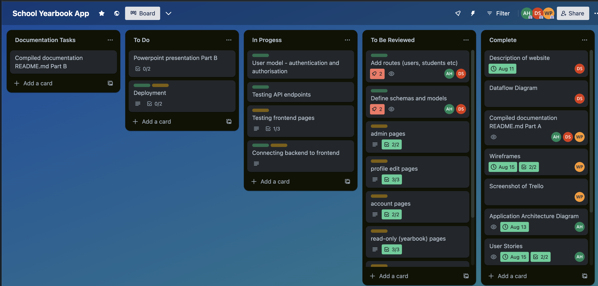

# T3A2 - Full Stack App

### By Dieter Schmid, Wenxuan Pan, Alicia Han

[Deployed Front End App](https://student-yearbook.vercel.app/)

[Deployed Back End App](https://student-year-book.onrender.com/)

[Front End Repo](https://github.com/wenxuan-pan/Full_Stack_App_T3A2-B-Frontend)

[Back End Repo](https://github.com/Dieter1978/Full_Stack_App_T3A2-B)

[Presentation](./ppt/presentation.pdf)

[Trello Board](https://trello.com/b/YU3ggBxC/school-yearbook-app)

## Table of Contents

1. [Description of website](#description-of-your-website)
2. [Dataflow Diagram](#dataflow-diagram)
3. [Application Architecture Diagram](#application-architecture-diagram)
4. [User Stories](#user-stories)
5. [Wireframes](#wireframes)
6. [Libraries Used](#libraries-used)
7. [Using the App](#using-the-app)
8. [User Testing](#user-testing)
9. [Trello Screenshots](#trello-screenshots)

## Description of your website

A digital School Yearbook that makes a record of all student in attendance at the particular year levels of the school.

### Purpose

To display a photo, contact information and the final year thoughts of students graduating the school. This becomes a permanent online record of all graduates of the school and it can be referred to by all stakeholders of the app.

### Functionality/Features

- The app will provide admin and students accounts with a login.
- admin can add students to the app
- The student can update their details in the app.
- The Admin can upload photos and display them for all students.
- The student can fill out a questionnaire regarding their final thoughts.
- The student can provide contact details.
- Admin can invite via email students to the app

### Target Audience

This application is targetted at all school stakeholders this includes students of the graduating year level but also other students at the schools. It also includes allumi and parents of students at the school. Lastly it includes teachers and staff.

### Tech Stack

The application will utilise a MongoDB connected to a express.js server built on node.js. The front end of the application will use react.js html and css. The server and front end will be deployed to cloud services.

## Dataflow Diagram

## Application Architecture Diagram

## User Stories

User stories were split into three categories:

1. All users (students and admin)
2. Admin only
3. Students only

Throughout the planning process, we found that we needed to add and modify ideas in order for the application to work better. Hence, user stories from the beginning of the planning phase were updated to reflect these changes. We have included both sets of user stories in this documentation:

### Initial User Stories

All users:

1. As a user, I would like to be able to add a student profile into different classes/cohorts and year levels, so that student data is organised into the correct categories.
2. As a user, I would like to be able to login and view a list of students in each class and year level/cohort at my school.
3. As a user, I would like to be able to click into individual students and see their relevant information, so that I can stay in touch with classmates and connect with acquaintances.
4. As a user, I would like to have a navigation bar so that I can easily access different parts of the website.

Admin only:

1. As an admin, I want to be able to remove any profile from the database to ensure data integrity.

Students only:

1. As a student, I would like to be able to update my information, so that others can get in touch with me via my current contact details if needed, however I would like to ensure that only admin and myself can manipulate my account, for better security.
2. As a student, I want to be able to delete any information on my account, or my entire profile, from the database so that I have control over my information.

### Revised User Stories to Reflect Updated Features

All users:

1. As a user, I would like to be able to login and view a list of classes in my school, and the students in each class.
2. As a user, I would like to be able to click into individual students and see their relevant information, so that I can stay in touch with my classmates and connect with acquaintances.
3. As a user, I would like to have a navigation bar so that I can easily navigate around the application.

Admin only:

1. As an admin, I would like to see a list of all yearbooks and classes at my school, and be able to modify or delete them as appropriate, in case of error or duplication.
2. As an admin, I would like to be able to input a class of students along with their email and photos, and modify and delete student data as needed in case of error or duplication.
3. As an admin, I would like to be able to have a unique code to give to students, so they can utilise it to sign up and create their own accounts linked to the student database, this will ensure that only students who are actually in the class will be able to register to that class.

Students only:

1. As a student, I would like to have a unique code from my school admin, to be able to register as an account that is linked to a yearbook in the database.
2. As a student, I would like to be able to add, modify and delete any of my data from my account, and ensure that only the admin or myself can manipulate my account, for better security.

## Wireframes

[View in Figma](https://www.figma.com/file/wEaYAPuL9deFJ3dAndN1Fq/Yearbook-wireframes?type=design&node-id=130-2&mode=design&t=GhTV1T7VudPXjCez-0)

Mobile:

Tablet:

Desktop:

## Libraries Used

* *express:* Express is a Node.js web framework simplifying web app/API development. It handles routing, middleware, HTTP requests, and responses, ideal for building RESTful APIs and web apps. Express offers templating, static file serving, and error handling. It's extensible with a robust community, providing a minimalistic yet highly flexible solution for efficient server-side applications.

* *react:* React is a JavaScript library for building user interfaces. It enables the creation of interactive, reusable UI components. React efficiently updates and renders components when data changes, enhancing performance. It supports a virtual DOM for optimized rendering, making it ideal for single-page applications. React can be used with other libraries and frameworks and is widely adopted for front-end development due to its component-based architecture and strong community support.

* *bcrypt:* bcrypt is a library for securely hashing and salting passwords in applications. It helps protect user data by converting passwords into irreversible, hashed values, making it difficult for attackers to decipher the original password. bcrypt employs a computationally intensive hashing algorithm to enhance security, mitigating brute-force and rainbow table attacks. It is widely used for password storage and authentication in web applications.

* *cors:* The CORS (Cross-Origin Resource Sharing) library is used in web applications to control how resources hosted on one domain can be accessed by web pages from another domain. It provides a way to define which origins (domains) are permitted to make requests to a web server, helping to enhance security by preventing unauthorized cross-origin requests.

* *dotenv:* The dotenv library simplifies the management of environment variables in Node.js applications. It loads environment variables from a .env file into the application's runtime environment. This allows developers to store sensitive or configuration-related data securely outside the codebase and access them easily. It's particularly useful for storing API keys, database credentials, and other configuration settings in a centralized and secure manner, ensuring that sensitive data is not exposed in source code repositories.

* *jsonwebtoken:* The jsonwebtoken library in Node.js helps create and verify JSON Web Tokens (JWTs) for user authentication and secure data exchange. It allows developers to encode and decode JWTs, which are compact, self-contained tokens used for securely transmitting information between parties. With jsonwebtoken, you can generate tokens containing user claims, sign them with a secret key, and verify their authenticity, ensuring data integrity and user authentication in web applications and APIs.

* *mongoose:* Mongoose is a Node.js library used for interacting with MongoDB databases in a structured and intuitive way. It simplifies database operations by providing an Object Data Modeling (ODM) layer that allows developers to define schemas and models for data, create, read, update, and delete documents in MongoDB, and perform queries and validations, making it easier to work with MongoDB in Node.js applications.

* *nodemon:* Nodemon is a utility for Node.js that monitors files in a project directory and automatically restarts the Node.js application when changes are detected. It simplifies the development process by eliminating the need to manually restart the server after code modifications, enhancing developer productivity and streamlining the debugging and testing of Node.js applications.

* *vite:* Vite is a build tool and development server for modern web applications. It offers rapid development with near-instantaneous hot module replacement (HMR), making it highly efficient for building front-end projects using JavaScript and TypeScript. Vite optimizes code splitting, lazy loading, and production builds, enhancing performance and developer experience.

* *vitest:* Vitest is a unit testing framework built on top of Vite with a focus on modern features and support for various JavaScript frameworks like Vue, React, Svelte, and Lit. Some of its notable features include component testing, TypeScript and JSX support, ESM (ECMAScript Modules) compatibility, and multithreading with workers. This makes it a versatile and powerful tool for unit testing in modern web development projects. Developers can leverage these features to ensure the quality and reliability of their code.

* *react-bootstrap:* The "react-bootstrap" library is a popular set of React components that offers pre-designed, customizable UI elements following the Bootstrap framework. It simplifies building responsive, visually appealing web interfaces in React applications by providing a range of components like buttons, forms, modals, and navigation bars. Developers can easily integrate these components into their projects, saving time on front-end development and ensuring consistent, mobile-friendly designs.

* *react-toastify:* The "react-toastify" library is used for displaying toast notifications in React applications. It simplifies the process of showing unobtrusive and customizable notifications to users, such as success messages, errors, or warnings. React-toastify offers a straightforward API to create and manage toast notifications, including features like auto-dismissal, positioning, and animation. It enhances the user experience by providing a consistent and user-friendly way to communicate important information without interrupting the flow of the application.

* *jsdom:* jsdom is a JavaScript library that allows you to create a simulated browser environment within a Node.js environment. It emulates a web browser's DOM (Document Object Model), enabling you to perform operations like rendering and manipulating web pages, running unit tests for web applications, and interacting with web page elements programmatically. jsdom is particularly useful for server-side rendering, testing, and automating tasks involving web pages in a Node.js context.

* *react-testing-library:* The react-testing-library is a utility library for testing React components. It focuses on testing user interactions with components in a way that simulates how users would interact with a real application. It encourages writing tests that are closer to end-user behavior by querying and interacting with rendered components, making it easier to write maintainable and robust tests. This library promotes best practices for testing React applications by emphasizing the testing of user experiences rather than implementation details.

* *react-router-dom:* The react-router-dom library is used for handling client-side routing in React applications. It enables developers to create dynamic, single-page applications with multiple views or pages. It provides a way to define and manage routes, allowing users to navigate between different components or views within a web application without the need to reload the entire page. This library simplifies the creation of navigation menus, deep linking, and routing configuration, enhancing the user experience in React-based web applications.

* *jest:* Jest is a JavaScript testing framework commonly used with Node.js and React applications. It simplifies unit and integration testing by providing a comprehensive toolset for writing, running, and asserting test cases. Jest offers features like automatic mocking, parallel test execution, and snapshot testing. It's known for its ease of use and speed, making it a popular choice for JavaScript developers to ensure the reliability and correctness of their code through test-driven development (TDD) and continuous integration.

* *supertest:* The Supertest library is a popular JavaScript library used for testing HTTP APIs. It provides a high-level, easy-to-use API for making HTTP requests to your API endpoints and then making assertions about the responses. Supertest can be integrated with testing frameworks like Mocha or Jest and is particularly useful for testing the functionality, behavior, and performance of RESTful APIs in Node.js applications. It allows developers to simulate HTTP requests and verify that the API responses match expected criteria.

## Using the App

The app has been set up with one admin user on the backend, this user will add year levels, schools and students. The login details are:

*Admin email*: john.smith@gmail.com

*Admin password*: testing

Please note that the backend test token inside src/backend/routes/test_token.js would need to be updated with the new admin token if the database is reseeded.

A student user has also been set up, the login details are:

*Student user email*: bill.smith@gmail.com

*Student user password*: anothertesting

### Installing the app locally

#### Frontend

Navigate to the frontend's folder. Use `npm install` to build the app. Use `npm run test-cc` to generate vitest coverage.

Connecting to Backend: 

The Frontend app fetches data from the deployed API by default. To change that to a local server, go to `src/utils/apiHelper.js`, and change the baseURL on line 3 (the default port for backend is 5175).

## User Testing

[User Testing PDF](./docs/usertesting.pdf)

[View As Google Sheets](https://docs.google.com/spreadsheets/d/1pefhrMjoiLZwKzy9ScchNq-p_7jmZtDbuWSV5q5xw5o/edit#gid=0)

## Trello Screenshots

